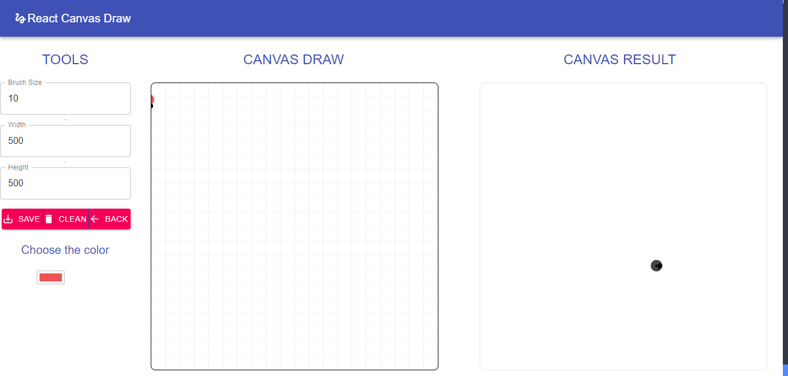
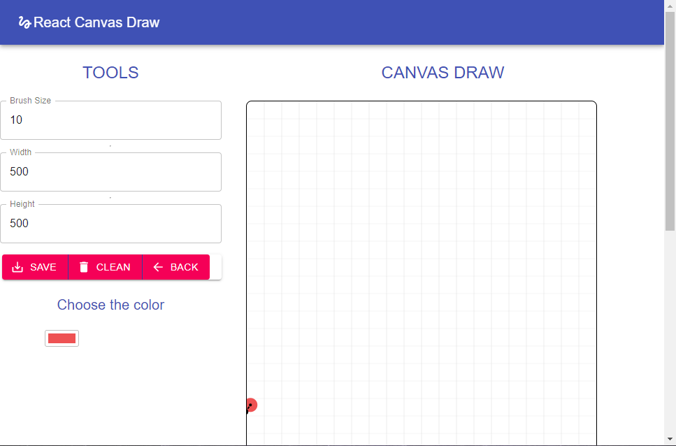
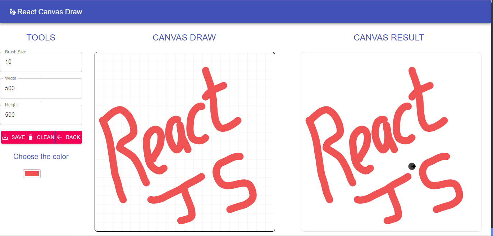

# REACT JS CANVAS DRAW

This is a simple project to draw using the library called react-canvas-draw, letting us create a canvas for draw





# Components used

* react-canvas-draw
* material-ui
* react-input-color

# Installation
clone the repo
```shell
git clone project
cd project
```
then execute:
```shell
npm install
npm start 
```


This project was bootstrapped with [Create React App](https://github.com/facebook/create-react-app).

### `npm start`

Runs the app in the development mode.<br />
Open [http://localhost:3000](http://localhost:3000) to view it in the browser.

The page will reload if you make edits.<br />
You will also see any lint errors in the console.

